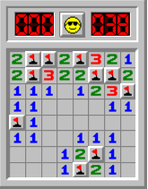

# Minesweeper



Given a 2D array that represents a minefield with randomly placed mines write
a function that returns a 2D array where each index contains the number of
mines at the 8 positions (4 sides, 4 corners too) around that location.

Use the number `9` to indicate that there is a mine at that location.

For example, given this 2D array
* `null` represents an empty cell
* `'*'` represents a mine

```
MINEFIELD = [
  [ null, null, null, null, '*' ],
  [ null, null, null, null, '*' ],
  [ '*', null, null, null, null ],
  [ null, null, null, '*', null ],
  [ null, '*', null, null, null ]
]
```

Return the following:

```
[ [ 0, 0, 0, 2, 9 ],
  [ 1, 1, 0, 1, 9 ],
  [ 9, 0, 1, 1, 1 ],
  [ 1, 1, 2, 9, 0 ],
  [ 1, 9, 0, 0, 0 ] ]
```

* Notice the `0` cells at the top are not touching any mine.
* Notice the two in the first tow touches a mine at two locations:
  * on it's right side
  * diagonally via it's bottom left corner
* The mine in the first column is mostly surrounded by `1` cells,
  except there's a single cell with a `2` which happens to be touching
  another mine below itself.

# Complexity
Your solution should be `O(N)` with respect to the total number of cells in
the 2D array.

# Solutions

### Simple Redundant Solution

```js
let MINEFIELD = [
  [null, null, null, null, '*'],
  [null, null, null, null, '*'],
  ['*', null, null, null, null],
  [null, null, null, '*', null],
  [null, '*', null, null, null]
];

// bounds-checking helper function
// returns an "empty" value if the coordinate doesn't exist.
function getCell(grid, row, col) {
  let empty = null;
  if (row < 0 || col < 0) {
    return empty;
  } else if (row >= grid.length) {
    return empty;
  } else if (col >= grid[row].length) {
    return empty;
  } else {
    return grid[row][col];
  }
}

// this function accepts a 2D array representing
// a minesweeper minefield. It returns a new 2D
// array where each cell has a number representing
// how many mines that cell touches, 
// let MINEFIELD = [
//   [null, null, null, null, '*']
//   [null, null, null, null, '*']
//   ['*', null, null, null, null]
//   [null, null, null, '*', null]
//   [null, '*', null, null, null]
// ]
// [
//  [0, 0, 0, 2, 9]
//  [1, 1, 0, 2, 9]
//  [9, 1, 1, 2, 2]
//  [2, 2, 2, 9, 1]
//  [1, 9, 2, 1, 1]
// ]
function markMines(field) {
  for (let row = 0; row < field.length; row++) {
    for (let col = 0; col < field[row].length; col++) {
      field[row][col] = countMines(field, row, col);
    }
  }
  
  return field;
}

function countMines(field, row, col) {
  // we must check for both '*' and 9 since we're modifying
  // the original array.
  if (field[row][col] === '*' || field[row][col] === 9) {
    return 9;
  }
  let result = 0;
  
  if (getCell(field, row - 1, col) === '*') { // north
    result++;
  }
  if (getCell(field, row + 1, col) === '*') { // south
    result++;
  }
  if (getCell(field, row, col + 1) === '*') { // east
    result++;
  }
  if (getCell(field, row, col - 1) === '*') { // west
    result++;
  }
  
  if (getCell(field, row - 1, col - 1) === '*') { // nw
    result++;
  }
  if (getCell(field, row - 1, col + 1) === '*') { // ne
    result++;
  }
  if (getCell(field, row + 1, col - 1) === '*') { // sw
    result++;
  }
  if (getCell(field, row + 1, col + 1) === '*') { // se
    result++;
  }
  
  return result;
}

console.log('Minefield:');
console.log(MINEFIELD);
console.log();

let result = markMines(MINEFIELD);

console.log('Result:');
console.log(result);
console.log();
```

### DRY Solution

```js
let MINEFIELD = [
  [null, null, null, null, '*'],
  [null, null, null, null, '*'],
  ['*', null, null, null, null],
  [null, null, null, '*', null],
  [null, '*', null, null, null]
];

// bounds-checking helper function
// returns an "empty" value if the coordinate doesn't exist.
function getCell(grid, row, col) {
  let empty = null;
  if (row < 0 || col < 0) {
    return empty;
  } else if (row >= grid.length) {
    return empty;
  } else if (col >= grid[row].length) {
    return empty;
  } else {
    return grid[row][col];
  }
}

// this function accepts a 2D array representing
// a minesweeper minefield. It returns a new 2D
// array where each cell has a number representing
// how many mines that cell touches, 
// let MINEFIELD = [
//   [null, null, null, null, '*']
//   [null, null, null, null, '*']
//   ['*', null, null, null, null]
//   [null, null, null, '*', null]
//   [null, '*', null, null, null]
// ]
// [
//  [0, 0, 0, 2, 9]
//  [1, 1, 0, 2, 9]
//  [9, 1, 1, 2, 2]
//  [2, 2, 2, 9, 1]
//  [1, 9, 2, 1, 1]
// ]
function markMines(field) {
  for (let row = 0; row < field.length; row++) {
    for (let col = 0; col < field[row].length; col++) {
      field[row][col] = countMines(field, row, col);
    }
  }
  
  return field;
}

function countMines(field, row, col) {
  // if the cell is a bomb, replace it with a 9.
  // we have to check for both '*' and 9 because it changes.
  let cellValue = getCell(field, row, col);
  if (cellValue === '*' || cellValue === 9) {
    return 9;
  }

  let totalNearbyMines = 0;

  // create an array representing every combination of row and column
  // offsets of all the different directiosn to look in.
  let rowColOffsets = [
    [-1, 0], [1, 0], [0, 1], [0, -1], // north, south, east, and west
    [-1, -1], [-1, 1], [1, 1], [1, -1]  // nw, ne, se, sw
  ];

  // iterate through each offset representing looking in each direction.
  for (let i = 0; i < rowColOffsets.length; i++) {
    let rowOffset = rowColOffsets[i][0];
    let colOffset = rowColOffsets[i][1];

    let rowIndex = row + rowOffset;
    let colIndex = col + colOffset;

    let neighborValue = getCell(field, rowIndex, colIndex);

    if (neighborValue === '*' || neighborValue === 9) {
      totalNearbyMines++;
    }
  }
  return totalNearbyMines;
}

console.log('Minefield:');
console.log(MINEFIELD);
console.log();

let result = markMines(MINEFIELD);

console.log('Result:');
console.log(result);
console.log();
```
